# Parking Lot Management System

**Design and implement a parking lot system on the given functional and non-functional requirements**

**Approach Used**

Designed the Parking lot system using object oriented programming concepts and used design principles for the implementation.

**Click on diagram.svg in file structure view the full image**

**Functional Requirements:**

1. The Number of floors and Number of Parking Spots per floor are taken at runtime by user via the terminal.
    
    
2. Vehicles can be of different types: Car, Bike, Truck.
    - This is implemented by an abstract vehicle class.

3. Used enums to facilitate different spots requirements for different vehicle types such as-
    1. Bike → 1 spot
    2. Car → 1 spot
    3. Truck → 2 consecutive spots
 
4. Finding the appropriate parking spot is handled by `ParkingStrategy` which can be extended to any strategy.

5. Leaving of vehicles is handled by `leaveVehicle` function which vacates the spot and removes the vehicle from the HashMap.
6. The system allows querying for the following via terminal:
    1. Number of available spots per floor.
    2. Whether the parking lot is full.
    3. The current location of a vehicle (if parked).

Non-Functional Requirements:
- The solution follows object-oriented programming principles and design principles to make the code easy to understand and easy to extend to new requirements.
- The system handles concurrent parking operations safely by using locks in critical functions such as `parkVehicle ` which is used to reserve a parking spot and `leaveVehicle` which is used to unreserve a parking spot.
- Optimized for quick vehicle lookup by using a HashMap having Vehicle details as its key and Parking spot as its value.

## OOPs principles

1. **Abstraction**

    Here abstraction is achieved by use of Interfaces and abstract classes.

    - Interfaces like `ParkingStrategy`, `VehicleValidator`, `ParkingLotOperations`,`ParkingSpotManager`, and `FloorOperations` abstract away the implementation details of their respective functionalities.

    - The `Vehicle` class abstracts common properties such as license plate and type of vehicle.

    - Hiding Complexity: ParkingLotUI handles user interactions, abstracting the underlying parking logic.

2. **Encapsulation**

    - `ParkingSpot` class encapsulates the state of a parking spot (`spotId`, `floor`, `isOccupied`, `vehicle`) with private fields and public methods.

    - `Floor` class encapsulates the list of parking spots and provides controlled access through methods.
    - `ParkingLot` class encapsulates the internal data structures (`floors`, `parkedVehicles)` and synchronization mechanisms (`lock`).
    - All classes use private fields with public getters/setters where appropriate.

3. **Inheritance**

    - Vehicle hierarchy: `Car`, `Truck`, and `Bike` classes inherit from the abstract `Vehicle` class.

    - Exception hierarchy: `InvalidVehicleException` inherits from `ParkingLotException`.

    - Implementation of inheritance through interfaces: classes implement interfaces like `ParkingLotOperations` and `FloorOperations`.

4. **Polymorphism**

    - Runtime polymorphism through the `Vehicle` class hierarchy - different vehicle types override `getSpotsNeeded()` as different vehicles have different spot requirements.

    <!-- - Interface polymorphism through interfaces like `ParkingStrategy` and `VehicleValidator`. -->

## SOLID Principles
1. **Single Responsibility Principle(SRP)**- Each class has a single, well-defined responsibility.
    - `ParkingSpot` manages individual spot state.
    - `Floor manages` collection of spots.
    - `VehicleFactory` handles vehicle creation.
    - `ParkingLotUI` handles user interaction.
    - `ParkingLot` coordinates parking operations.

2. **Open/Closed Principle**- The system is open for extension but closed for modification.
    - New vehicle types can be added by extending the `Vehicle` class.
    - New parking strategies can be implemented through the `ParkingStrategy` interface.
    - New validation rules can be added by implementing the `VehicleValidator` interface.

3. **Liskov Sbstitution Principle (LSP)**- The principle defines that objects of a superclass shall be replaceable with objects of its subclasses without breaking the application.
    - All `vehicle` subtypes (`Car`, `Truck`, `Bike`) can be used wherever a Vehicle is expected.
    - The parking lot system works correctly with any implementation of the defined interfaces.

4. **Interface Segregation Principle (ISP)**-Interfaces are segregated based on specific responsibilities:
    - `ParkingLotOperations` for parking lot operations.
    - `ParkingSpotManager` for spot management.
    - `VehicleValidator` for validation.
    - `FloorOperations` for floor-specific operations.

5. **Dependency Inversion Principle (DIP)**- Any higher classes should always depend upon the abstraction of the class rather than the detail.
    - `ParkingLot` depends on `ParkingStrategy` and `VehicleValidator` interfaces, not on concrete classes.
    - `ParkingLotUI` depends on `ParkingLotOperations`interface
    
    - Decoupled Design: Swapping validators or strategies requires minimal changes.

## Design Patterns

- **Factory Pattern**- `VehicleFactory` for creating vehicle instances.
- **Strategy Pattern**: `ParkingStrategy` for flexible parking algorithms.

## Future Extensions
- We can have multiple algorithms to reserve the parking spot such as farthest first.
- We can add transactions by saving timestamps and use singleton design pattern for its implementation.
- We can also extend if different vehicles require different types of spots for parking.
